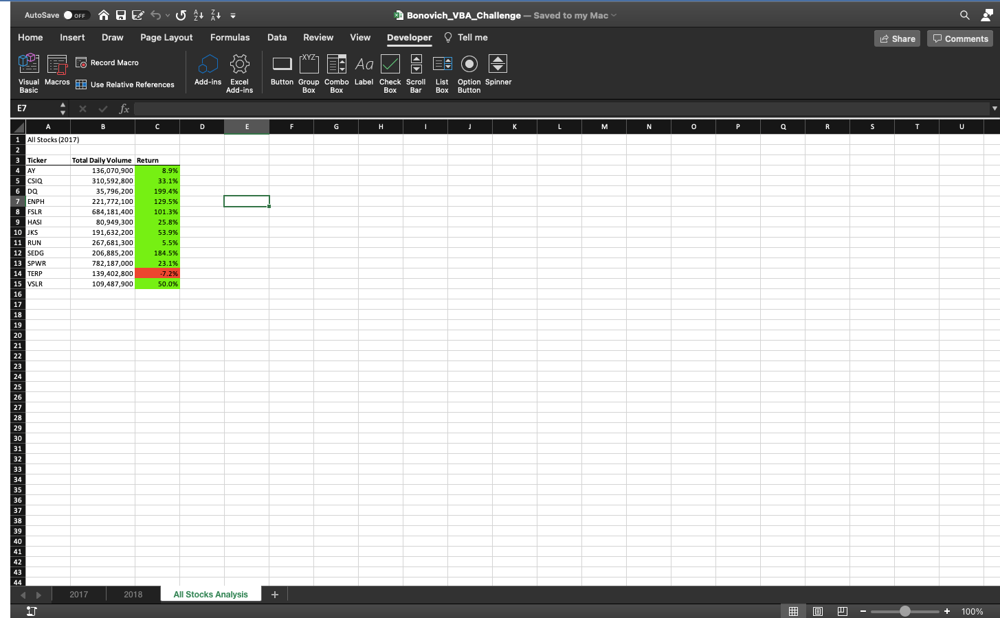
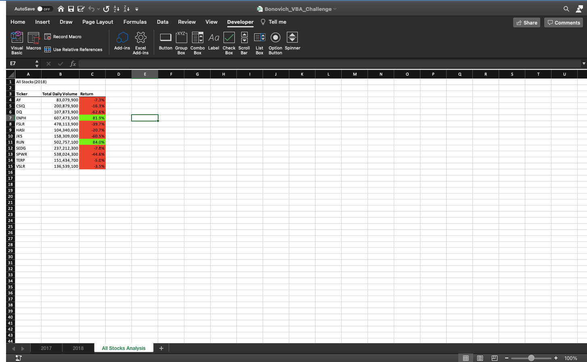

# An Analysis of 12 Stocks

## Overview of Project

### Purpose
 
Steve and his family needs support to select a clean energy stock to invest funds. The stock analysis file contains valuable information for twelve stocks such as the open, high, low, close, adjusted close prices and daily volume on select days in 2017 and 2018. I will analyze the data to determine which stocks perfromed better annually in 2017 and 2018. Below are visualizations of my findings.
 
## Results

### Analysis of Outcomes in 2017

In 2017, DQ was the top performer with a whopping annual return of 199.4%. On the otherhand TERP was the worst performer with a dissapointing annual return of -7.2%. Furthermore, SPWR had the highest total daily volume at 782,187,000, and DQ had the lowest total daily volume at 35,796,200. Overall, 2017 was a great year to invest in clean energy, as TERP was the only stock with a negative annual return.

### Analysis of Outcomes in 2018

In 2018, RUN was the top performer with an annual return of 84.0%. On the otherhand DQ was the worst performer with an annual return of -62.6%. Furthermore, SPWR had the highest total daily volume at 538,024,000, and AY had the lowest total daily volume at 83,079,900. Overall, 2018 was a tough year to invest in clean energy, as ENPH and RUN were the only stock with a positive annual return.

## Summary

### Advantages and Disadvantages of Refactoring Code in General

In general, the advantage of refractoring code is that safe and timesaving to not need to worry about syntax. A lot of refractoring requires copy and pasting old code. Since most of the code was already provided, refactoring was a safe and timesaving maneuver to help Steve and his family obtain their results. On the flip side, one disadvantage of refactoring code is that new logic requires new and untested logic, which can be time consuming as it requires discipline to have a deeper understanding of your old logic in order to build new logic. 

### Advantages and Disadvantages of the Original and Refactored VBA Script

The advantages of the original VBA script is that it required me to deeply understanding each line of code I wrote, and to get used to the syntax. However, this was greatly time consuming, and a difficult process to become oriented with VBA Scripts. On the otehr hand, the advantages of reactoring VBA scripts is that I was able to better organize my code and it took me a lot less time since I only needed to rename variables. However, I felt like this process hindered my understanding of VBA scripts as I copy and pasted my old code blindly. Overall I think refactoring was a more efficient process, but I would have most likely learned more and bettered myself and my understanding of VBA scripts by starting from scratch.
